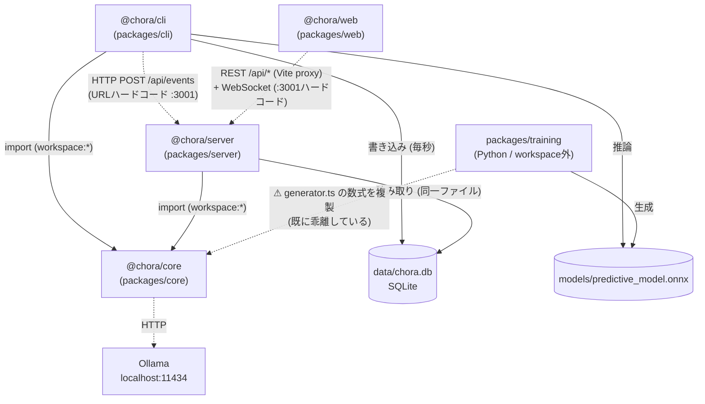
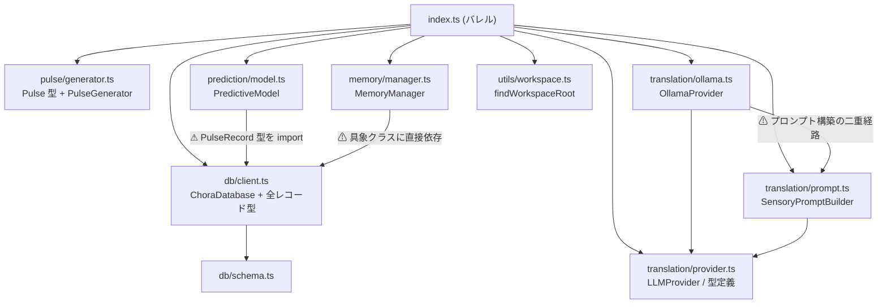

# CHORA リファクタリング計画書

**作成日:** 2026-06-11
**対象リビジョン:** `master` (01fd7da 時点 + 未コミット変更)
**方針:** 分析と提案のみ。本書はコード変更を伴わない。

---

## 1. 現状の依存関係と構造的ボトルネック

### 1.1 パッケージ間依存グラフ



実線 = 静的 import 依存。点線 = ランタイム結合(型契約なし)。

### 1.2 `@chora/core` 内モジュール依存グラフ



### 1.3 検出された構造的問題

#### (a) 循環依存

**静的な import 循環は存在しない。** ただし以下の 2 つの「実質的な循環」がある。

1. **プロセス間フィードバックループ(最重要)**
   `CLI → (HTTP POST) → server → (同一 SQLite 読込) → CLI が書いたデータ` という閉路。
   CLI は [packages/cli/src/index.ts:20](packages/cli/src/index.ts#L20) で `http://localhost:3001/api/events` をハードコードして server へイベントを push し、同時に server は CLI が書き込む同一の `data/chora.db` を独立に開いて読む([packages/server/src/index.ts:17](packages/server/src/index.ts#L17))。つまり **同一状態への二重経路**(イベント push と DB ポーリング)が型契約なしで並走しており、イベントペイロードの形(`tick` / `naming` / `decay`)は CLI が生成・server が素通し・web が独自 interface で再定義、と 3 箇所で暗黙に複製されている。

2. **ドメイン⇆インフラの概念的逆転**
   `Pulse`(ドメイン型)は `pulse/generator.ts` に、ほぼ同形の `PulseRecord` は `db/client.ts` に定義され、Layer 1 の [prediction/model.ts:2](packages/core/src/prediction/model.ts#L2) は**永続化モジュールから**ドメイン型を import している。型のハブが `db/client.ts` になっているため、「DB を差し替える」「予測層だけテストする」いずれの変更も db モジュールを巻き込む。

#### (b) God Object / God Function

| 対象 | 場所 | 症状 |
|---|---|---|
| `ChoraDatabase` | [packages/core/src/db/client.ts](packages/core/src/db/client.ts) (377行) | 5 テーブル分のリポジトリ + 接続管理 + マイグレーション(空 catch の ALTER TABLE 5連発, L90–116) + ドメインロジック(`decayAllNamings` = 記憶減衰の業務ルールが SQL に直書き, L254) + 統計の二重管理(`insertNaming` 内で `unique_names` カウンタ更新, L189) を 1 クラスで担う |
| CLI `main()` / `tick()` | [packages/cli/src/index.ts:29](packages/cli/src/index.ts#L29) (約360行) | 制御ループ・コンソール描画・telemetry 送信・冷却ロック・**Layer 3 の命名解決ロジック**(L221–273: `use_existing_name` 検証 → ハルシネーション時の新規挿入フォールバック → 強化)をすべて内包。`@chora/cli` にはテストが無いため、**システムの中核ビジネスロジックが唯一テスト不能な場所に置かれている** |
| `App.tsx` | [packages/web/src/App.tsx](packages/web/src/App.tsx) (588行) | WebSocket クライアント・REST 取得・状態管理・4 つの可視化パネル・色決定・2D 射影計算を単一コンポーネントで実装。`getDistance4D` は `MemoryManager` のユークリッド距離計算の複製 |

#### (c) レイヤー越え・関心の漏出

1. **CLI が Layer 3 を実装**: 命名の解決・強化・ハルシネーション処理は記憶管理(Layer 3)の中核だが、`MemoryManager` を素通りして CLI が `db.getAllActiveNamings()` / `db.insertNaming()` を直接呼ぶ([packages/cli/src/index.ts:227](packages/cli/src/index.ts#L227), L247, L262)。さらに `MemoryManager.reinforceNaming` 内でも同じ全件取得+線形探索が再実行され、1 回の翻訳で同一クエリが複数回走る。
2. **プロンプト構築の二重経路**: `OllamaProvider.generateNaming` は `TranslationPrompt | string` を受け取り、内部でも `SensoryPromptBuilder.build` を呼べる([packages/core/src/translation/ollama.ts:22](packages/core/src/translation/ollama.ts#L22))一方、CLI は事前に文字列化して渡す。言語選択(`PROMPT_LANG`)は CLI 経路でしか効かず、provider 経路だと常に既定言語になる。抽象(`LLMProvider`)が実装詳細(プロンプト整形)に依存している。
3. **core がモノレポ構造に依存**: `findWorkspaceRoot`([packages/core/src/utils/workspace.ts](packages/core/src/utils/workspace.ts))は `pnpm-workspace.yaml` を探して登る。ライブラリをパッケージ外へ配布・デプロイすると壊れる。実際、`packages/cli/data/chora.db` という**迷子の DB ファイル**が存在し、パス解決が過去に失敗した痕跡がある。
4. **スキーマの二重管理**: [schema.ts](packages/core/src/db/schema.ts) の CREATE TABLE には `forgotten` / `last_decayed_at` 列が無く、client.ts の ad-hoc ALTER で後付けされる。新規 DB と既存 DB で「正」が分散している。

#### (d) クロス言語の単一情報源違反(サイレント劣化中)

[train.py](packages/training/train.py) は `PulseGenerator` の数式を Python で複製しているが、**TypeScript 側だけが更新され既に乖離している**:

| 項目 | generator.ts (現行) | train.py (旧式のまま) |
|---|---|---|
| Signal C | ultradian 成分あり、`bInfluence` 双方向 | ultradian 無し、`b_influence = max(0, B−0.6)` 片方向 |
| Signal D | `meanD=0.4`、`stressDrag` 双方向 (係数0.03) | `mean_d=0.3`、stress>0.6 のみ (係数0.05) |

つまり ONNX モデルは**実行時とは異なる分布で学習されており**、サプライズ(RMSE)が系統的に膨らみ、翻訳トリガ頻度という本プロジェクトの観測対象そのものを歪めている。これはアーキテクチャ上の欠陥(数式の単一情報源が無い)の直接的な実害。

#### (e) テストの腐敗

- [prompt.test.ts:44](packages/core/src/translation/prompt.test.ts#L44) は「非常に近い」「やや近い」「記憶にない感覚パターンです」を期待するが、現行実装の出力は「再利用推奨」「参考」「(記録なし)」であり、さらに既定言語が `en` に変わったため**現状失敗するはず**。
- [model.test.ts](packages/core/src/prediction/model.test.ts) は実 ONNX ファイルが必要な統合テストで、ユニットテストと混在。
- CLAUDE.md の記述(「50 サイクルごとに decay」「既定モデル llama3」)も実装(30 分壁時計 / Qwen3-4B)と乖離。

---

## 2. アーキテクチャ方針

### 2.1 基本原則

1. **ドメイン型の独立(依存性逆転)** — `Pulse` / `Naming` / `Prediction` などの型を `core/src/domain/` に集約し、db・prediction・memory・translation はすべて domain に依存する。infra(db)→domain の一方向にする。現状の `db/client.ts` ハブを解体する。

2. **Ports & Adapters** — 副作用境界をインターフェース(port)化する:
   - `NamingRepository` / `PulseRepository` 等(SQLite 実装は adapter)
   - `LLMProvider`(既存。ただし入力は**文字列のみ**に統一し、プロンプト整形は翻訳サービス側の責務へ)
   - `EventSink`(telemetry 送信。HTTP 実装・null 実装・テスト用 fake)
   - `Clock`(冷却・減衰のテスト可能化)

3. **制御ループの core 移管** — `tick()` のオーケストレーション(生成→予測→サプライズ判定→翻訳→減衰)を `ChoraEngine` として core に置き、CLI は「設定の組み立て + コンソール描画」だけの薄い殻にする。**ビジネスロジックは必ずテスト可能なパッケージに置く**。

4. **イベント契約の型共有** — `tick` / `naming` / `decay` / `init_stats` のペイロード型を 1 箇所(`core/src/events.ts` または軽量な `@chora/protocol`)で定義し、CLI(生産者)・server(中継)・web(消費者)が同じ型を import する。

5. **DB アクセスの単一書き込み者原則の明文化** — 現行の「CLI が書き、server が同一ファイルを読む」WAL 構成は維持してよいが、**server は読み取り専用**であることを接続オプションとコードで明示する(将来的には server を唯一の DB 所有者にし CLI はイベント送信のみ、という選択肢も残す)。

6. **数式の単一情報源** — 学習データ生成を TypeScript 側(`PulseGenerator` 本体)から行い、train.py は生成済みデータを読むだけにする。Python での数式複製を撤廃する。

### 2.2 目標とするレイヤー構造

```
packages/core
├── domain/          # 型のみ。依存先なし (Pulse, Naming, Prediction, SystemState, events)
├── pulse/           # Layer 0 → domain
├── prediction/      # Layer 1 → domain (db への依存を断つ)
├── translation/     # Layer 2: PromptBuilder + LLMProvider(string in / NamingResponse out)
├── memory/          # Layer 3: NamingService(検索・解決・強化・減衰) → domain + repository port
├── engine/          # ChoraEngine: tick オーケストレーション → 各層の port のみ
└── infra/
    ├── sqlite/      # 接続 + マイグレーション + リポジトリ実装
    └── telemetry/   # HttpEventSink ほか
```

依存方向は常に `infra → domain` / `engine → ports`。逆流を lint(`eslint-plugin-import` の zones 等)で機械的に禁止する。

---

## 3. 段階的リファクタリング・ロードマップ

各フェーズは独立してマージ可能で、外部から見た挙動を変えない(Phase 5 のモデル再学習を除く)。

### Phase 1: 足場固め — ドメイン型の独立とテスト健全化

- **目的:** 型ハブ `db/client.ts` の解体準備。腐敗したテストを直し、以降のフェーズの安全網を作る。
- **対象ファイル:**
  - 新規: `packages/core/src/domain/types.ts`(`Pulse`, `PulseRecord`, `PredictionResult`, `NamingRecord`, `TranslationEventRecord`, `SystemStateRecord` を移設)、`packages/core/src/domain/events.ts`(`TickEvent` / `NamingEvent` / `DecayEvent` / `InitStatsEvent`)
  - 変更: `db/client.ts`・`prediction/model.ts`・`memory/manager.ts`・`index.ts` の import を domain 参照へ書き換え(re-export で後方互換維持)
  - 修正: `translation/prompt.test.ts`(現行出力に追従)、`prediction/model.test.ts`(ONNX 必須テストに `describe.skipIf(!fs.existsSync(modelPath))` 等の明示)
  - 修正: `CLAUDE.md` の decay 周期・既定モデルの記述
- **完了条件:** `pnpm build` と `pnpm test` が全緑。`prediction/` と `memory/` から `db/` への型 import が消えている。`@chora/core` の公開 API(`index.ts` のエクスポート)は不変。

### Phase 2: 永続化層の分割 — ChoraDatabase の解体

- **目的:** God Object の解消。マイグレーションの一元化と、リポジトリ単位のテスト可能化。
- **対象ファイル:**
  - 新規: `packages/core/src/infra/sqlite/connection.ts`(WAL/busy_timeout 設定 + 読み取り専用オプション)、`migrations.ts`(schema.ts の CREATE 文と ad-hoc ALTER を番号付きマイグレーションに統合)、`pulse-repository.ts` / `naming-repository.ts` / `prediction-repository.ts` / `translation-event-repository.ts` / `system-state-repository.ts`
  - 変更: `db/client.ts` は各リポジトリへ委譲するファサードとして残す(段階的廃止)。`insertNaming` 内の統計カウンタ更新は `system-state-repository` 経由に移す。`getRecentHistory` の戻り値 `any[]` を domain 型に修正
  - 削除候補: `db/schema.ts`(migrations.ts へ吸収)
- **完了条件:** 各リポジトリが単機能(概ね 150 行以下)。空 catch の ALTER TABLE が消え、マイグレーションが冪等かつ一覧可能。`memory/manager.test.ts` 相当のテストがリポジトリ単位で追加され全緑。server・CLI は無変更で動作。

### Phase 3: ドメインサービスとエンジン抽出 — CLI の脱・God Function

- **目的:** Layer 2/3 のビジネスロジック(命名解決・強化・冷却・減衰スケジュール)を core に移し、テストで覆う。CLI を薄い殻にする。
- **対象ファイル:**
  - 新規: `packages/core/src/memory/naming-service.ts`(`findSimilar` + `resolveNaming`(use_existing 検証/ハルシネーション・フォールバック/新規挿入/強化を一手に担う)— 現 `MemoryManager` を吸収)、`packages/core/src/translation/translation-service.ts`(プロンプト構築→LLM 呼び出し→`NamingResponse` 検証。言語選択もここに集約)、`packages/core/src/engine/chora-engine.ts`(tick オーケストレーション。`Clock` / `EventSink` / `LLMProvider` / 各リポジトリを注入)、`packages/core/src/infra/telemetry/http-event-sink.ts`
  - 変更: `translation/ollama.ts` — `generateNaming(prompt: string)` に統一し、`prompt.ts` への依存を削除。`packages/cli/src/index.ts` — 設定読込・依存組み立て・`ConsoleRenderer`(バー描画)のみに縮小
- **完了条件:** `packages/cli/src/index.ts` が約 100 行以下で、`db.*` 直接呼び出しゼロ。`ChoraEngine` がフェイク Clock/LLM/Sink によるユニットテストで「サプライズ→翻訳トリガ」「冷却」「減衰」「ハルシネーション・フォールバック」を検証済み。実行時の出力(ログ・DB 内容・イベント)が従来と同等。

### Phase 4: プロセス境界の契約化 — server / web の整理

- **目的:** CLI⇆server⇆web の暗黙結合を型契約に置き換え、God Component を分割する。
- **対象ファイル:**
  - 変更: `packages/server/src/index.ts` — `createApp()`(ルート定義)/`createBroadcastHub()`(WS 管理)/起動コードに分離。DB 接続を読み取り専用で開く。`domain/events.ts` の型でペイロードを検証
  - 変更: `packages/web/src/App.tsx` — `hooks/useChoraSocket.ts`(WS 接続+再接続)、`hooks/useBaselineData.ts`(REST)、`components/PulseChart.tsx` / `SelfModelMap.tsx` / `NamingTimeline.tsx` / `MemoryCloud.tsx` に分割。イベント型は core の `domain/events.ts` を共有(tsconfig の paths か `@chora/core` 依存追加)。`getDistance4D` 等の重複計算は core からの re-export を利用
  - 変更: URL/ポートのハードコード(`:3001` × CLI・web の 2 箇所)を環境変数+既定値の単一設定モジュールへ
- **完了条件:** web・server が同一のイベント型を import してコンパイルが通る。`App.tsx` が 150 行以下。WS ポート・server URL が env で変更可能。手動確認: `pnpm dev` でダッシュボードが従来どおり tick/naming/decay を表示。

### Phase 5: 学習パイプラインの単一情報源化

- **目的:** generator.ts ⇆ train.py の数式乖離(§1.3-d)を構造的に解消し、学習分布と実行時分布を一致させる。
- **対象ファイル:**
  - 新規: `scripts/generate-training-data.mjs`(ビルド済み `@chora/core` の `PulseGenerator` で 20 万ステップを生成し `packages/training/data/pulses.npy` または CSV に出力)
  - 変更: `packages/training/train.py` — `PulseGeneratorPython` クラスを削除し、生成済みデータの読込に置換
  - 再生成: `models/predictive_model.onnx`(再学習)
  - 追記: `CLAUDE.md` / `README` に「生成→学習→配置」の手順
- **完了条件:** train.py に信号生成の数式が存在しない。再学習後、定常運転時のサプライズ分布が改善(平常時 RMSE の中央値が閾値 0.15 を明確に下回る)ことをログまたはダッシュボードで確認。`model.test.ts` 緑。

### フェーズ依存関係

```
Phase 1 ──→ Phase 2 ──→ Phase 3 ──→ Phase 4
   └────────────────────────────────→ Phase 5 (Phase 1 完了後ならいつでも可)
```

---

## 4. 補足: 即時対応を推奨する小規模事項(フェーズ外)

- `packages/cli/data/chora.db` — パス解決失敗の痕跡である迷子ファイル。原因確認のうえ削除・`.gitignore` 整備。
- `prompt.test.ts` の失敗(Phase 1 に含むが、CI を導入するなら最優先)。
- `OllamaProvider` の既定モデル文字列が CLI 側の既定([cli/src/index.ts:60](packages/cli/src/index.ts#L60))と二重定義 — 設定一元化(Phase 4)までの間も片方を参照に統一するのが安全。

---

**Phase 5 完了 (2026-06-15):** `scripts/generate-training-data.mjs` を新設し、`packages/training/train.py` から `PulseGeneratorPython` クラス(信号生成数式の Python 複製)を完全削除。`generator.ts` を学習データ生成の唯一の情報源とした。再学習後の平均 RMSE: 0.036 (旧: 0.150)、翻訳トリガ率: 1.1% (旧: 48.3%)。
